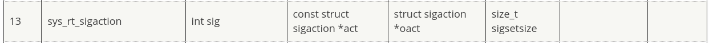

# SaaS - Syscall as a Service
__Category__: Pwn   
__Points__: 100  

> You've heard of software as a service,  
> but have you heard of syscall as a service?
>
> Attachement: [saas](./saas)

__Important:__   
This writeup is an addition to the other writeups
of this challenge. The other writeups show how to read the
flag file but this writeup shows how to get full code execution.   
Make sure to read [this writeup](https://github.com/Heinzeen/ctf/blob/master/Nahamcom_2020/saas/saas_writeup.md) by [Heinzeen](https://github.com/Heinzeenhttps://github.com/Heinzeen) to see the intended solution for this challenge.

### Quick Recap
The program lets us make arbitrary amd64 system calls except:
- sys_execve
- sys_fork
- sys_clone
- sys_kill
- sys_ptrace
- sys_tkill
- stub_execveat

The return value of the system call is echoed back to the user.

Also the binary has all protections enabled:
```
RELRO           STACK CANARY      NX            PIE             RPATH      RUNPATH      Symbols         FORTIFY Fortified       Fortifiable  FILE
Full RELRO      Canary found      NX enabled    PIE enabled     No RPATH   No RUNPATH   77 Symbols     Yes      0               1       saas
```

### Exploit Strategy
If the binary wouldn't be position independent, executing shellcode would be trivial: Just mark the text-segment as writable with mprotect() and overwrite .text with our shellcode.
Unfortunately we are completely blind.

As the other writeups show, we can use mmap() to get our data into the process.
Since mmap() can create executable regions we can use this
to store shellcode that pops a shell (see [shellcode.asm](./shellcode.asm)).    
The only question that remains is: How do we get control over the instruction pointer with system calls?   
And that's where signals come in handy!    
If we manage to recrate the following code snippet we can get full code execution:
```c
void* shellcode = mmap(NULL, 0x1337, PROT_READ | PROT_WRITE | PROT_EXECUTE, MAP_PRIVATE | MAP_ANONYMOUS, -1, 0);
read(0, shellcode, 0x1337);
signal(SIGHUP, shellcode);
raise(SIGHUP);
```
Note that SIGHUP is chosen arbitrarily. We can use any other signal.

### Installing a Signal Handler
Let's recreate
```c
signal(SIGHUP, shellcode)
```
with some system calls.   
The system call that installs a signal handler is ```sys_rt_sigaction``` (number 13). It takes the following arguments:

The ```struct sigaction``` looks like this:
```c
struct kernel_sigaction
{
    __sighandler_t k_sa_handler;
    unsigned long sa_flags;
    void (*sa_restorer) (void);
    sigset_t sa_mask;
};
```
```k_sa_handler``` is the handler function for the signal. This will be the address of our shellcode. ```sa_flags``` and ```sa_mask``` will be 0 since we don't want any special behaviour. ```sa_restorer``` normally contains a pointer to a function that restores the state of the process right before jumping to the signal handler. This is where sigreturn normally comes into play. In our case this field doesn't matter because
execve will replace the process anyway but in the exploit script I set this to the address of our shellcode.    
```oact``` also doesn't matter and can be NULL and ```sigsetsize``` is 8.

### Delivering a signal
I chose to deliver a signal with the ```sys_tgkill``` system call (number 234). This system call just takes a process id and a signal and delivers that signal to the process. Nothing special.

### Crafting the exploit
We can now combine everything into following exploit:
1. mmap() a region for our shellcode (must be executable)
2. Write our shellcode into the region
3. mmap() a region for the ```struct sigaction``` with the following values:  
  - ```k_sa_handler``` = shellcode
  - ```sa_flags``` = 0
  - ```sa_restorer``` = shellcode (but doesn't matter really)
  - ```sa_mask``` = 0
4. Install the signal handler
5. Deliver the signal
6. ???
7. Profit

See [exploit.py](./exploit.py) for a concrete implementation.
